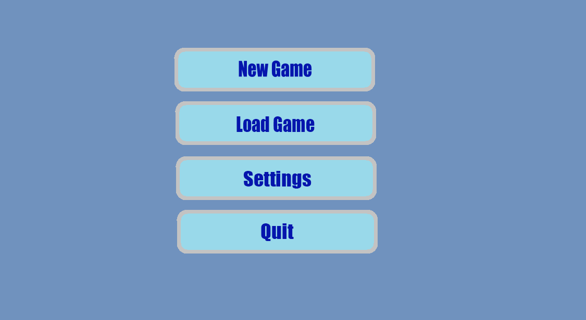

# HCI HomeWork: 2D Platformer
<!DOCTYPE html>
<html lang="en">
<head>
    <meta charset="UTF-8">
    <meta http-equiv="X-UA-Compatible" content="IE=edge">
    <meta name="viewport" content="width=device-width, initial-scale=1.0">
</head>
<body>
    <header>
        <h1>2D Platformer</h1>
        <dl>
            <dt>Authors</dt>
            <dd>Todica Lucian (3B4)
            <dt>Faculty of Computer Science, "Alexandru Ioan Cuza" University, Iași, Romania</dt>
        </dl>
    

        <ol role="directory">
            <li><a href="#1-project-details">Project Details</a></li>
            <li><a href="#2-About">Introduction</a> </li>
            <ol>
                <li>Genre</li>
                <li>Target Audience</li>
            </ol>
            <li><a href="#3-user-interface">User Interface</a>
                <ol role="structure-directory">
                    <li><a href="#31-startap-screen">Startup Screen</a></li>
                    <li><a href="#32-game-ui">Game UI Sketches</a></li>
                </ol>
            </li>
        </ol>
    

    <section id="project-details" role="doc-abstract">
        <h2>1. Project details</h2>
        
Implementation of a 2D platformer game

    </section>
    <section id="introduction" role="doc-introduction">
        <h2>2. Introduction</h2>
    </section>
    <section id="genre" role="doc-introduction">
        <h3>2.1.Genre</h3>
        
2D Platformer – In this game, you navigate levels using a side-scrolling view. The entire level is built with each object in place, but players only see a portion of the level. This is done by having the camera view follow the character’s movements. Players will not be able to move the camera on their own. Scattered across the map there will be enemies that will attempt to defeat the player and various items that will help the player in their adventure

    </section>
        <section id="target" role="doc-introduction">
        <h3>2.2.Target Audience</h3>
        
This game is for everybody. It will appeal to both seasoned gamers and those new to the hobby. The target age is 10+, and is not specific to any gender.

        </section>
    <section id="user-interface" role="doc-structure">
        <h2>3. User Interface</h2>
        
Here are a few schetches of the user interface.

    </section>
    <section id="startup-screen" role="doc-structure">
        <h3>Startup Screen</h3>
        
        
This is a simple homescreen with options to start a new game, load a current save or change game settings

        </section>
    <section id="game-ui" role="doc-structure">
        <h3>Game UI Sketches</h3>
        

        </section>
    </header>
</body>
</html>
